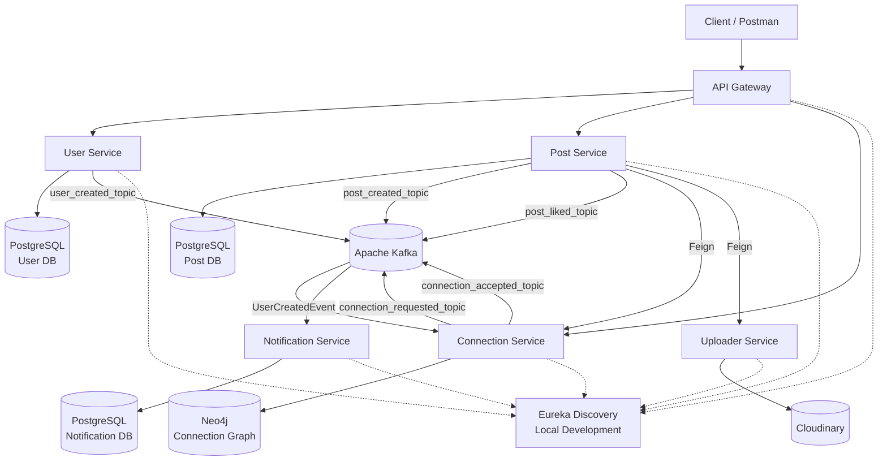

# Conectia

Conectia is a backend for a LinkedIn-style social platform that I built to understand how a real application starts to look when it is split into multiple services.

The main idea was not to put everything inside one Spring Boot application. I separated authentication/users, posts, connections, notifications and file uploads into independent services and then connected them using both synchronous and asynchronous communication.

The project can be run locally with the services talking to each other directly, and it also contains Kubernetes manifests for running the application as a containerized system.

---

## What I built

The application currently contains these services:

| Service | Responsibility | Main technology |
|---|---|---|
| API Gateway | Single entry point, routing and JWT authentication | Spring Cloud Gateway |
| User Service | Signup, login and user data | Spring Boot + PostgreSQL |
| Post Service | Creating/fetching posts and likes | Spring Boot + PostgreSQL |
| Connection Service | Connection requests and graph relationships | Spring Boot + Neo4j |
| Notification Service | Consumes events and stores notifications | Spring Boot + PostgreSQL + Kafka |
| Uploader Service | Uploads post files/images | Spring Boot + Cloudinary |
| Discovery Service | Service discovery for local development | Netflix Eureka |
| Kafka | Event-driven communication | Apache Kafka |
| Databases | Isolated persistence per service | PostgreSQL + Neo4j |
| Kubernetes | Container orchestration | Kubernetes |

The important part of the architecture is that each service owns its own data. For example, the Post Service does not directly use the User Service database, and the Connection Service uses Neo4j because the connection graph is naturally represented as nodes and relationships.

---

## Architecture



### Local vs Kubernetes service discovery

I use two different approaches because the environment is different.

**Local development**

Services register with Eureka and can discover each other through service names.

**Kubernetes**

The Kubernetes services themselves provide DNS-based service discovery. The Kubernetes configuration disables Eureka registration/lookup and uses Kubernetes service names such as:

```text
user-service
posts-service
connections-service
notification-service
uploader-service
kafka
```

This keeps the deployment architecture independent of Eureka when running inside Kubernetes.

---

# Core flows

## 1. User signup

A signup request enters through the API Gateway and is routed to the User Service.

```text
Client
  |
  v
API Gateway
  |
  v
User Service
  |
  +--> PostgreSQL
  |
  +--> Kafka
          |
          v
   user_created_topic
          |
          v
   Connection Service
          |
          v
      Neo4j
```

When a user is created, the User Service publishes a `UserCreatedEvent`.

The Connection Service listens to `user_created_topic` and creates a corresponding `Person` node in Neo4j.

This means the graph does not have to be maintained through a synchronous call from User Service to Connection Service.

---

## 2. Connection request

A connection request is handled by the Connection Service.

```text
Client
  |
  v
API Gateway
  |
  v
Connection Service
  |
  +--> Neo4j
  |
  +--> connection_requested_topic
                    |
                    v
            Notification Service
                    |
                    v
             Notification DB
```

The service checks:

- sender and receiver are not the same
- a request does not already exist
- the users are not already connected

After the relationship is created, a `ConnectionRequestedEvent` is published.

The Notification Service consumes that event and creates a notification for the receiver.

---

## 3. Accepting a connection

The Connection Service checks that the request exists and that the users are not already connected.

The Neo4j relationship changes from:

```text
(:Person)-[:REQUESTED_TO]->(:Person)
```

to:

```text
(:Person)-[:CONNECTED_TO]-(:Person)
```

It then publishes a `ConnectionAcceptedEvent`.

The Notification Service consumes the event and stores a notification for the user who originally sent the request.

---

## 4. Creating a post

Creating a post demonstrates the synchronous + asynchronous combination used in the project.

```text
Client
  |
  v
API Gateway
  |
  v
Post Service
  |
  +--> Feign --> Uploader Service --> Cloudinary
  |
  +--> PostgreSQL
  |
  +--> Feign --> Connection Service
                     |
                     v
              First-degree connections
                     |
                     v
              Kafka: post_created_topic
                     |
                     v
              Notification Service
```

The Post Service:

1. Gets the authenticated user ID from the request context.
2. Sends the uploaded file to the Uploader Service using OpenFeign.
3. Saves the post and returned image URL in PostgreSQL.
4. Calls the Connection Service using OpenFeign.
5. Gets the user's first-degree connections.
6. Publishes a `PostCreated` event for each connection.
7. The Notification Service consumes those events and creates notifications.

This is one of the main reasons I did not use only REST calls everywhere. The post creation path needs a response to the user, while notification creation can happen independently.

---

## 5. Post likes

When a post is liked:

```text
Post Service
     |
     +--> PostgreSQL
     |
     +--> post_liked_topic
                |
                v
       Notification Service
                |
                v
        Notification DB
```

The like is stored in the Post Service database and a `PostLiked` event is published for the notification flow.

---

# Communication patterns

I deliberately used more than one communication style.

### Synchronous communication

OpenFeign is used where the caller needs a response immediately.

Examples:

- Post Service -> Connection Service
- Post Service -> Uploader Service

For example, before generating notifications for a new post, the Post Service needs the user's first-degree connections.

### Asynchronous communication

Kafka is used for events where the originating service should not have to wait for the notification workflow.

Topics currently used:

| Topic | Producer | Consumer |
|---|---|---|
| `user_created_topic` | User Service | Connection Service |
| `connection_requested_topic` | Connection Service | Notification Service |
| `connection_accepted_topic` | Connection Service | Notification Service |
| `post_created_topic` | Post Service | Notification Service |
| `post_liked_topic` | Post Service | Notification Service |

Kafka topics are configured with 3 partitions in the services that create them.

---

# Authentication

Authentication is handled centrally at the API Gateway.

The flow is:

```text
Login
  |
  v
User Service
  |
  v
JWT returned to client
  |
  v
Client sends Authorization: Bearer <token>
  |
  v
API Gateway
  |
  +--> validates JWT
  |
  +--> extracts user ID from JWT subject
  |
  +--> adds X-User-Id header
  |
  v
Downstream Service
```

The gateway has a custom `AuthenticationFilter`.

Protected routes currently include:

```text
/api/v1/post/**
/api/v1/connection/**
```

The user ID extracted from the JWT is forwarded internally as:

```text
X-User-Id
```

The Post Service and Connection Service place that value into a request-scoped `ThreadLocal` context and their Feign interceptor forwards it when one service calls another.

This avoids sending the JWT around between every internal call while still carrying the authenticated user identity.

---

# Database design

I intentionally did not use one database for the whole application.

## User Service

Uses PostgreSQL for user records.

```text
users
-----
id
name
email
password
```

Passwords are hashed using BCrypt before being stored.

## Post Service

Uses PostgreSQL.

Main entities:

```text
Post
----
id
content
imageUrl
userId
createdAt

PostLike
--------
id
userId
postId
createdAt
```

## Notification Service

Uses PostgreSQL.

```text
Notification
------------
id
userId
message
createdAt
```

## Connection Service

Uses Neo4j.

Users are represented as:

```text
(:Person)
```

Relationships include:

```text
REQUESTED_TO
CONNECTED_TO
```

The graph database makes queries such as first-degree connections natural:

```text
(Person A)-[:CONNECTED_TO]-(Person B)
```

This was one of the main reasons I used Neo4j instead of trying to model the connection graph using only relational tables.

---

# API Gateway routes

The gateway exposes the application through a single entry point.

| Gateway route | Destination |
|---|---|
| `/api/v1/users/**` | User Service |
| `/api/v1/post/**` | Post Service |
| `/api/v1/connection/**` | Connection Service |

The gateway strips the `/api/v1/...` prefix before forwarding the request.

For example:

```text
POST /api/v1/users/auth/signup
```

is forwarded to the User Service without the gateway prefix.

---

# Main API endpoints

## Authentication

### Signup

```http
POST /api/v1/users/auth/signup
Content-Type: application/json
```

Example:

```json
{
  "name": "John Doe",
  "email": "john@example.com",
  "password": "password"
}
```

### Login

```http
POST /api/v1/users/auth/login
Content-Type: application/json
```

The response contains the JWT access token.

---

## Posts

### Create post

```http
POST /api/v1/post/core/create
Authorization: Bearer <JWT>
Content-Type: multipart/form-data
```

Multipart fields:

```text
post
file
```

The `post` part contains the post JSON and `file` contains the uploaded media.

### Get post

```http
GET /api/v1/post/core/{postId}
Authorization: Bearer <JWT>
```

### Get all posts of a user

```http
GET /api/v1/post/core/users/{userId}/allPosts
Authorization: Bearer <JWT>
```

---

## Likes

### Like a post

```http
POST /api/v1/post/likes/{postId}
Authorization: Bearer <JWT>
```

### Unlike a post

```http
DELETE /api/v1/post/likes/{postId}
Authorization: Bearer <JWT>
```

---

## Connections

### Get first-degree connections

```http
GET /api/v1/connection/core/{userId}/first-degree
Authorization: Bearer <JWT>
```

### Send connection request

```http
POST /api/v1/connection/core/request/{userId}
Authorization: Bearer <JWT>
```

### Accept connection request

```http
POST /api/v1/connection/core/accept/{userId}
Authorization: Bearer <JWT>
```

### Reject connection request

```http
POST /api/v1/connection/core/reject/{userId}
Authorization: Bearer <JWT>
```

---

# Project structure

```text
Conectia/
│
├── apiGateway/
│   └── API Gateway + JWT authentication
│
├── userService/
│   └── Authentication and user management
│
├── postService/
│   └── Posts, likes and post events
│
├── connectionService/
│   └── LinkedIn-style connection graph
│
├── notificationService/
│   └── Kafka consumers and notification persistence
│
├── uploaderService/
│   └── File upload abstraction
│
├── discoveryService/
│   └── Eureka server for local service discovery
│
└── k8s/
    ├── api-gateway.yml
    ├── user-service.yml
    ├── user-db.yml
    ├── posts-service.yml
    ├── posts-db.yml
    ├── connections-service.yml
    ├── connections-db.yml
    ├── notification-service.yml
    ├── notification-db.yml
    ├── uploader-service.yml
    ├── kafka.yml
    └── ingress.yml
```

---

# Technology stack

### Backend

- Java
- Spring Boot
- Spring Web MVC
- Spring Cloud Gateway
- Spring Cloud OpenFeign
- Spring Cloud Netflix Eureka
- Spring Data JPA
- Spring Data Neo4j
- Spring for Apache Kafka
- JWT
- BCrypt
- ModelMapper
- Lombok

### Databases

- PostgreSQL
- Neo4j

### Infrastructure

- Docker container images
- Jib
- Kubernetes
- Kubernetes StatefulSets
- Kubernetes Deployments
- Kubernetes Services
- Kubernetes Ingress
- PersistentVolumeClaims

### External storage

- Cloudinary

---

# Containerization

I use Google's Jib Maven plugin to build container images directly from the Maven projects.

There are no manually maintained Dockerfiles for the Spring Boot services.

The image naming convention is:

```text
docker.io/anshu988/conectia-app-<service-name>:<version>
```

The Kubernetes manifests reference the corresponding images.

For example:

```text
conectia-app-api-gateway
conectia-app-user-service
conectia-app-posts-service
conectia-app-connections-service
conectia-app-notification-service
conectia-app-uploader-service
```

This keeps the container build process inside the Maven build.

---

# Kubernetes deployment

The `k8s/` directory contains the deployment configuration for the complete backend infrastructure.

The manifests include:

- Deployments for application services
- StatefulSets for PostgreSQL
- StatefulSet for Neo4j
- StatefulSet for Kafka
- Kubernetes Services for internal communication
- Persistent storage claims
- Ingress configuration

The architecture inside Kubernetes looks roughly like this:

```text
                    Internet
                       |
                       v
                    Ingress
                       |
                       v
                 API Gateway
                       |
        +--------------+--------------+
        |              |              |
        v              v              v
   User Service   Post Service   Connection Service
        |              |              |
        v              v              v
     User DB         Post DB         Neo4j

        Post Service --------> Uploader Service
                                      |
                                      v
                                  Cloudinary

 User / Post / Connection Services
              |
              v
            Kafka
              |
              v
      Notification Service
              |
              v
       Notification DB
```

---

# Running locally

## Prerequisites

Install:

- Java
- Maven (or use the included Maven Wrapper)
- PostgreSQL
- Neo4j
- Apache Kafka

Make sure the local services are available on the ports expected by the configuration.

The default local configuration uses:

```text
Eureka       8761
API Gateway  8080
User         9010
Post         9020
Connection   9030
Notification 9040
Uploader     9050
Kafka        9092
```

The PostgreSQL databases used by the local configuration are:

```text
userDB
postDB
notificationDB
```

Neo4j is used by the Connection Service.

---

## Start order

A simple local startup order is:

```text
1. PostgreSQL
2. Neo4j
3. Kafka
4. Eureka Discovery Service
5. User Service
6. Connection Service
7. Post Service
8. Notification Service
9. Uploader Service
10. API Gateway
```

Each service can be started from its own directory using the Maven wrapper.

Windows:

```powershell
.\mvnw.cmd spring-boot:run
```

Linux/macOS:

```bash
./mvnw spring-boot:run
```

---

# Kubernetes deployment

Before deploying, make sure:

1. A Kubernetes cluster is available.
2. The cluster has a working StorageClass.
3. An Ingress controller is installed if the included Ingress resource is going to be used.
4. The container images are accessible from the cluster.
5. Cloudinary credentials are supplied securely.
6. Database credentials are changed from the example values.
7. Any platform-specific storage configuration is adjusted if required.

Apply the manifests from the `k8s` directory:

```bash
kubectl apply -f k8s/
```

Then check the resources:

```bash
kubectl get pods
kubectl get services
kubectl get statefulsets
kubectl get deployments
```

For the ingress:

```bash
kubectl get ingress
```

The exact external URL depends on the Kubernetes platform and its Ingress/load-balancer configuration.

---

# Configuration

The repository contains separate configuration for local and Kubernetes environments.

Local configuration generally points to:

```text
localhost
```

Kubernetes configuration uses Kubernetes DNS names such as:

```text
user-service
posts-service
connections-service
notification-service
uploader-service
kafka
```

Database connection information is passed through environment variables in the Kubernetes deployments.

Examples include:

```text
DB_SERVER
DB_NAME
DB_USERNAME
DB_PASSWORD
```

Secrets should not be committed to source control. Use Kubernetes Secrets, environment variables, or the secret-management system provided by the cloud platform.

---

# Why the architecture is split this way

I did not split the application into services just to say that it uses microservices.

Each service has a reasonably clear responsibility:

**User Service**

Owns identity and authentication.

**Connection Service**

Owns the social graph. Neo4j is a much better fit for relationship traversal than treating the graph as ordinary user data.

**Post Service**

Owns post and like data.

**Notification Service**

Does not need to block user actions. It reacts to events from Kafka and stores notification records.

**Uploader Service**

Keeps external file-storage logic away from the Post Service.

**API Gateway**

Gives the client one entry point and provides a central place for request routing and JWT validation.

This also makes it possible to change or scale individual parts without turning the whole backend into one large application.

---

# A small example of event-driven behavior

Suppose user `10` sends a connection request to user `20`.

The Connection Service creates the relationship:

```text
10 -> REQUESTED_TO -> 20
```

Then it publishes:

```text
ConnectionRequestedEvent
{
    senderId: 10,
    receiverId: 20
}
```

Kafka delivers the event to the Notification Service.

The Notification Service creates a notification for user `20`.

The Connection Service does not need to directly call the Notification Service.

The same pattern is used for:

```text
Connection accepted
Post created
Post liked
```

This keeps notification processing separate from the core operation.

---

# Error handling

The services contain centralized exception handling for common application errors such as:

- Bad requests
- Resource not found
- Invalid operations

Responses are converted into structured API error responses rather than exposing raw exceptions to the client.

---

# Current limitations / things I would improve next

This project is intentionally a backend-focused implementation and there are still things I would improve before calling it production-ready.

### 1. Secrets

Some development configuration contains credentials directly in configuration files. These should be removed and replaced with environment variables or Kubernetes Secrets before a public production deployment.

### 2. JWT secret management

The JWT signing key should be stored outside the repository and injected through a secret-management mechanism.

### 3. Notification APIs

The Notification Service currently focuses on consuming events and storing notifications. A proper read/unread notification API would be a natural next step.

### 4. Better Kafka reliability

For a production system I would add stronger delivery guarantees, retry handling, dead-letter topics and better event versioning.

### 5. Observability

The next infrastructure layer I would add is centralized logging, metrics and distributed tracing using tools such as Prometheus, Grafana and OpenTelemetry.

### 6. Kubernetes secrets and storage

The current manifests are a working starting point, but storage classes, ingress configuration and secret management should be adapted to the target Kubernetes provider.

### 7. Scaling

Individual services can be scaled independently. The next step would be adding multiple replicas, readiness/liveness probes and resource tuning for each workload.

---

# What I learned from building this

The main thing I wanted from this project was to understand what actually changes when an application moves from a simple Spring Boot backend to a distributed system.

Some of the important parts I worked through were:

- Designing service boundaries
- Keeping databases isolated between services
- Using Neo4j for a social graph
- Implementing JWT authentication at the gateway
- Passing authenticated user context to internal services
- Using OpenFeign for synchronous service-to-service calls
- Using Kafka for asynchronous events
- Handling JSON event serialization/deserialization
- Building container images with Jib
- Running stateful infrastructure inside Kubernetes
- Using Kubernetes DNS for internal service communication
- Managing PostgreSQL and Neo4j as separate stateful workloads
- Connecting application services with external object/file storage

The project also made it clear that microservices are not simply "multiple Spring Boot projects". Once services are separated, communication, failures, data ownership, deployment and configuration all become part of the design.

---

# Repository notes

The repository contains the source code for each service along with the Kubernetes deployment configuration.

If you want to understand the project from the outside in, I recommend looking at it in this order:

```text
1. k8s/
2. apiGateway/
3. userService/
4. connectionService/
5. postService/
6. notificationService/
7. uploaderService/
8. discoveryService/
```

The Kubernetes directory gives the overall deployment picture, while the individual services show how each part of the system is implemented.

---

## Author

**Brajmohan**

Built as a hands-on backend and distributed-systems project to go beyond CRUD applications and understand microservices, event-driven architecture, graph databases and Kubernetes deployment.
